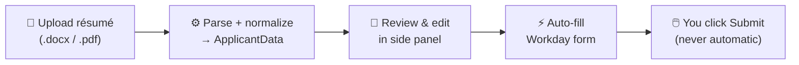
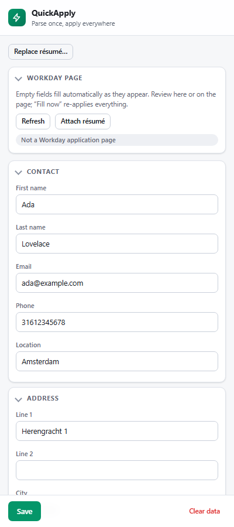

<p align="center">
  
</p>

<h1 align="center">QuickApply</h1>

A Chrome extension (MV3) that parses your résumé, lets you review and edit the extracted
fields in a side panel, remembers them across devices via your Google account, and
pre-fills job-application forms — starting with **Workday**.


## How it works



## The side panel

<p align="center">
  
</p>

## What it does

1. **Upload** a résumé (`.docx` or `.pdf`).
2. **Parse + normalize** it into a website-agnostic `ApplicantData` model.
3. **Review & edit** every field in the side panel (inline validation).
4. **Save** — fields roam to your other devices via `chrome.storage.sync`.
5. **Auto-fill** a Workday application: as fields appear (on load and across steps), the
   extension fills empty ones — text, dropdowns, multiselect, dates, checkboxes — without
   overwriting what you typed. Review in the panel/page; "Fill now" re-applies; attach the
   résumé file with one click. **You click Submit — QuickApply never does.**

## Architecture (4 layers)

Data flows one direction; `src/core/*` is pure and browser-free (no `chrome.*` / DOM).

| Layer | Location | Responsibility |
|---|---|---|
| 1. Parser | `src/core/parser` | résumé text → `RawResume` (regex fields + best-effort sections + date ranges) |
| 2. Normalizer | `src/core/normalizer` | `RawResume` → `ApplicantData` (name casing, work/education dates, field of study) |
| 3. ApplicantData | `src/core/applicant-data` + `src/types` | the normalized Zod model + `StoragePort` interface |
| 4. Site Adapter | `src/core/site-adapter` (interface) + `src/site-adapters/workday` (impl) | `ApplicantData` → form fills (`plan`/`fill`, never submit) |

**Edge modules** (touch the browser, live outside `src/core`):
- `src/parsers/docx`, `src/parsers/pdf` — text extraction (mammoth / pdf.js, lazy-loaded).
- `src/storage/synced-storage-adapter` — full model roams via `chrome.storage.sync`,
  chunked to beat the 8 KB/item cap, with a local mirror; `resume-file-store` keeps the
  original file locally.
- `src/site-adapters/workday` — field map, DOM interaction strategies, résumé attach.
- `entrypoints/` — `background` (opens side panel), `sidepanel` (React app), `content`
  (Workday-scoped; handles preview/fill/attach messages).

## Stack

WXT · React + TypeScript · Chrome Side Panel API · Zod · Vitest (unit) · Playwright (DOM
e2e) · pnpm. No UI library — the side panel uses its own small design system
(`entrypoints/sidepanel/style.css`: CSS custom properties, automatic light/dark theme,
drag-and-drop upload, collapsible sections, sticky save bar). Render it headlessly with
`node e2e/screenshot-panel.mjs` (screenshots land in `e2e/.tmp/`).

## Commands

```
pnpm dev       # WXT dev server + HMR
pnpm build     # production build → .output/chrome-mv3
pnpm test      # Vitest unit suite
pnpm e2e       # Playwright DOM e2e (adapter fill against fixtures)
pnpm compile   # wxt prepare + tsc typecheck
```

> On this machine pnpm runs via `corepack pnpm <cmd>` (a direct global install is blocked).

## Install locally

> ⚠️ **Under active development.** QuickApply is not on the Chrome Web Store yet and is
> pre-1.0 — expect rough edges and breaking changes. It only acts on Workday pages, never
> auto-submits a form, and never stores passwords or payment details. Install at your own
> discretion.

**Option A — from a release build (no toolchain needed)**

1. Download `quickapply-chrome-mv3.zip` from the [Releases](../../releases) page and unzip it.
2. Open `chrome://extensions` and enable **Developer mode** (top-right).
3. Click **Load unpacked** and select the unzipped `chrome-mv3` folder.
4. Click the QuickApply toolbar icon to open the side panel.

**Option B — build from source**

```
corepack pnpm install
corepack pnpm build      # → .output/chrome-mv3
```

Then load `.output/chrome-mv3` via **Load unpacked** as in steps 2–4 above. For live
development use `corepack pnpm dev` instead (WXT dev server + HMR).

## Workday support

Field selectors are keyed on tenant-agnostic `data-automation-id`s captured from live
postings. See **`docs/workday-dom-reference.md`** for the full application DOM (all six
steps, widget patterns, and the `ApplicantData` mapping).

Implemented: account email; My Information name/phone/address/city/postal/country; My
Experience job title/company/role description/dates/skills/degree/links; résumé file
attach. Custom dropdowns, multiselects, date pickers, and checkboxes are handled via
per-strategy DOM interactions (native property setter for React-controlled inputs).

**Never auto-filled:** passwords, the `beecatcher` honeypot, and EEO / Voluntary
Disclosure / Self-Identify fields.

### Capturing more DOM

Interactive tools in `e2e/capture/` open a real Workday page (you sign in) and dump
`data-automation-id` structure. See `e2e/real-run.md`.

## Development workflow

- **OpenSpec is the source of truth.** Every change is proposed under
  `openspec/changes/<id>/` (proposal → specs → tasks), implemented, then archived; the
  living specs are in `openspec/specs/`.
- Rules for AI agents and humans are in `AGENTS.md` (`CLAUDE.md` imports it).

## Status & roadmap

Done: scaffold; docx + PDF parsing + editable preview; cross-device sync; Workday text +
rich-field fill; structured address; résumé attach; work/education date parsing.

Not yet (need a live Workday pass or more capture): repeatable work/education entries
(multiple jobs via `add-button`), multi-step auto-advance, and Greenhouse/other sites.
Fill strategies for custom widgets are validated on fixtures modeled from captured markup;
confirm on a real posting.
